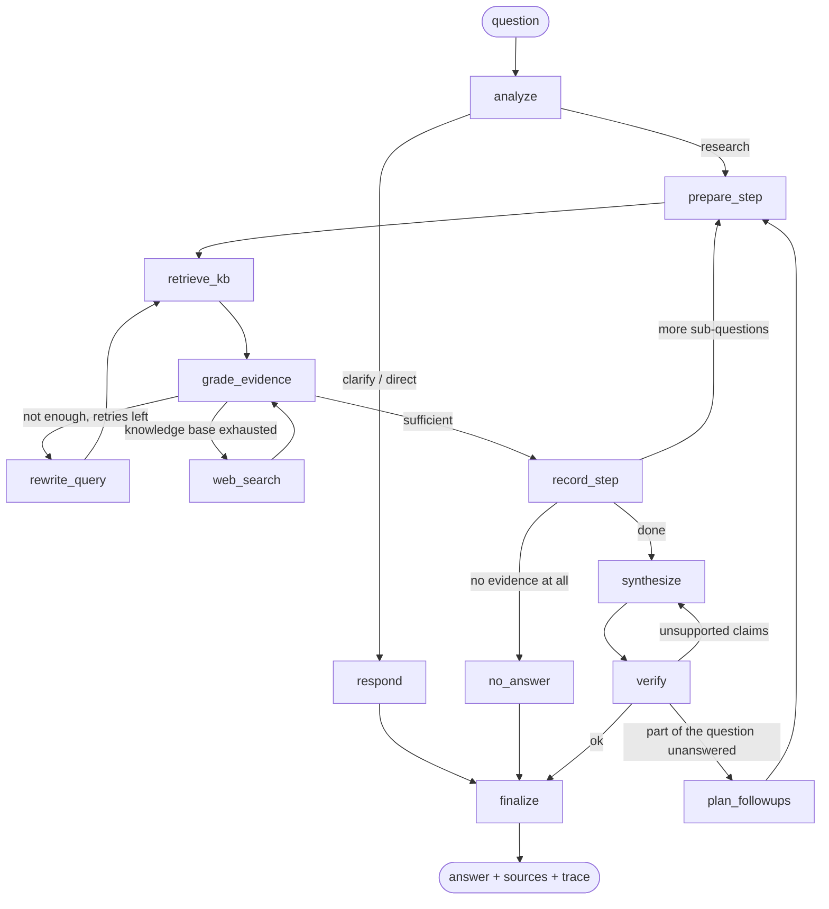

# Multi-Step Research Assistant

**Live demo: <https://autom8ai-research-assistant.onrender.com/>** · [API docs](https://autom8ai-research-assistant.onrender.com/docs) · [health](https://autom8ai-research-assistant.onrender.com/health)

A research assistant over a private document knowledge base. It plans, retrieves, checks its own
evidence, searches the web when the documents fall short, writes a cited answer, and then fact-checks
that answer before returning it. FastAPI backend, LangGraph agent, hybrid Qdrant retrieval, and a
small test UI.

Everything runs on free tiers or locally: **Groq** for inference (free API key), **FastEmbed** ONNX
embeddings on CPU (no key), **Qdrant** embedded on disk (no server), **DuckDuckGo** or Tavily for web
fallback, **Tesseract** for OCR.

> **Before you click the demo:** it runs on a free Render instance that sleeps after 15 minutes of
> inactivity, so the first page load can take up to a minute while the container wakes. A question
> takes 20-60 seconds - the assistant makes several LLM calls and shows each reasoning step as it
> happens. The eight sample documents are baked into the image; documents you upload live only until
> the instance restarts.

Good first question to try, because no single passage answers it:

> The annual report names a single-sourced supplier for the Atlas lidar. Which company is that, where
> is it based, and when does its contract end?

Then ask the same thing with **Ask with naive retrieval** to see what a single retrieve-and-generate
pass does with it.

---

## Contents

- [Quick start](#quick-start)
- [What it does](#what-it-does)
- [Architecture](#architecture)
- [Why these choices](#why-these-choices)
- [API](#api)
- [Sample knowledge base](#sample-knowledge-base)
- [Evaluation](#evaluation)
- [Tests](#tests)
- [Deployment](#deployment)
- [Configuration](#configuration)
- [Project layout](#project-layout)
- [Limitations](#limitations)

---

## Quick start

Requirements: Python 3.11 or 3.12, and `tesseract` if you want OCR for scanned pages.

```bash
# 1. dependencies
python -m venv .venv && source .venv/bin/activate      # Windows: .venv\Scripts\activate
pip install -r requirements.txt

# OCR (optional but recommended - the sample corpus includes scanned pages)
sudo apt install tesseract-ocr        # macOS: brew install tesseract
                                      # Windows: https://github.com/UB-Mannheim/tesseract/wiki

# 2. one free API key
cp .env.example .env
#    put a Groq key in GROQ_API_KEY - https://console.groq.com/keys (no card required)

# 3. run
uvicorn app.main:app --reload
```

Open <http://localhost:8000> for the test UI, or <http://localhost:8000/docs> for the API docs.

On first start the app downloads the embedding models (~70 MB) and ingests `data/corpus/` into the
vector store. `GET /health` shows progress in the `seeding` field; the UI shows it in the sidebar.

Docker (this is what the deployed instance runs):

```bash
docker build -t research-assistant .
docker run -p 8000:8000 -e GROQ_API_KEY=gsk_... -e SEED_ON_STARTUP=false research-assistant
```

The image downloads the embedding models **and ingests `data/corpus/` at build time**, so the
container starts with a populated vector store and needs no parsing, OCR or model download at
runtime. That is why `SEED_ON_STARTUP=false` is set above; leaving it `true` is harmless (the app
skips seeding when the collection already has documents) but the explicit setting makes the intent
obvious in a deployment.

Ask something that no single passage answers:

```bash
curl -s localhost:8000/ask -H 'content-type: application/json' -d '{
  "question": "The annual report names a single-sourced supplier for the Atlas lidar. Which company is that, where is it based, and when does its contract end?"
}' | python -m json.tool
```

---

## What it does

| Requirement | How it is implemented |
|---|---|
| Ingest multiple formats | One entry point (`app/ingestion/parsers.py`) for PDF, DOCX, HTML, Markdown, TXT, CSV/TSV, JSON and images. Format is detected from magic bytes, then extension, then MIME type - never from the caller's claim. |
| Scanned documents | PDF pages with almost no text layer are rendered and OCR'd per page (pypdfium2 + Tesseract); image uploads are OCR'd directly. Pages that needed OCR are flagged in the document list and in source metadata. |
| Chunking that survives retrieval | Section- and page-aware blocks, small sections packed together, then recursive splitting. Every chunk is stored with a `Document | Section | Page` header inside the embedded text, so retrieval can match on document and section names too. |
| Query understanding | One LLM pass rewrites follow-ups into standalone questions, classifies intent (research / clarify / direct), records the interpretation of ambiguous wording, and decomposes the question into sub-questions. |
| Multi-step retrieval | Each sub-question gets its own retrieval loop. Dependent ("multi-hop") sub-questions are rewritten with the values found by earlier steps before they are searched. |
| Hybrid search | Dense (bge-small) + sparse BM25 vectors fused with Reciprocal Rank Fusion inside Qdrant, plus a second RRF pass across the keyword query and the natural-language question. |
| Evidence grading & rewriting | A grader marks which passages are actually relevant, whether they are sufficient, and proposes a different query when they are not. Only graded-relevant passages become citable evidence. |
| Web fallback | When the knowledge base cannot support a sub-question after retries, the agent searches the web (DuckDuckGo without a key, Tavily with one). Web evidence is labelled as such in the answer and in the sources. |
| Cited answers | The answer cites `[n]` markers that map to the returned source list (document, section, page, snippet, or URL for web sources). |
| Fact-checking | A verification pass lists unsupported claims and unaddressed parts of the question. Unsupported claims trigger one rewrite; anything still unsupported is flagged in the answer and lowers the reported confidence. Missing aspects trigger one extra research round. |
| Conversation memory | LangGraph checkpointer per `conversation_id`; earlier turns are used to resolve references such as "their contract". |
| Honest failure | If nothing supports an answer, the assistant says so and lists what it searched for instead of guessing. |
| Streaming reasoning | `POST /ask/stream` emits each reasoning step as NDJSON as it happens; the UI renders the live trace. |
| Evaluation | `eval/` contains a 15-question set built around this corpus and a runner that scores the agent against a naive single-pass RAG baseline. |

---

## Architecture

```
                 ┌──────────────┐
  upload / URL → │  ingestion   │ parse → section/page blocks → contextual chunks
                 └──────┬───────┘
                        ▼
              ┌───────────────────┐        dense: BAAI/bge-small-en-v1.5 (FastEmbed, local)
              │ Qdrant collection │        sparse: Qdrant/bm25 (IDF)
              └─────────┬─────────┘        fusion: RRF inside Qdrant
                        │
  question →  ┌─────────▼──────────┐
              │ LangGraph agent    │ → answer + citations + reasoning trace
              └─────────┬──────────┘
                        │ LLM calls (Groq: gpt-oss-120b / gpt-oss-20b)
                        │ web fallback (DuckDuckGo / Tavily)
```

The agent graph (`GET /graph` returns this as Mermaid, generated from the compiled graph):



What each node is for:

| Node | Job |
|---|---|
| `analyze` | Rewrite the message as a standalone question, pick intent, note assumptions for ambiguous terms, decompose into sub-questions and mark which ones depend on earlier answers. |
| `prepare_step` | Start a sub-question. For dependent steps, substitute values found earlier ("that supplier" → "SUP-117"). |
| `retrieve_kb` | Hybrid search with both the keyword query and the question; results fused by RRF; passages already kept for this step are skipped. |
| `grade_evidence` | Keep only passages that actually answer the sub-question; decide sufficiency; write the step's finding; propose a better query. Warns about near misses (wrong model, wrong fiscal year, superseded version, same name for a different thing). |
| `rewrite_query` | Retry retrieval with the grader's query, or with the question plus what is missing. |
| `web_search` | Last resort for a sub-question: DuckDuckGo or Tavily; results are graded by the same grader. |
| `record_step` | Mark the step answered / partial / not found and move on. |
| `synthesize` | Write the answer from numbered evidence only, with citations, noting supersessions and gaps. |
| `verify` | Fact-check the draft against the evidence: unsupported claims, unaddressed parts, confidence. |
| `plan_followups` | Turn unaddressed parts into extra sub-questions (one round). |
| `finalize` | Map citations to sources, set grounding (knowledge base / web / mixed) and confidence, append any fact-check warning, and store the turn in conversation memory. |

Retries are bounded (`MAX_KB_ATTEMPTS`, `MAX_REVISIONS`, `MAX_FOLLOWUP_ROUNDS`, `MAX_SUB_QUESTIONS`), so a
question cannot loop indefinitely. Every node appends a trace entry, which is what the UI streams.

---

## Why these choices

**Hybrid retrieval, not pure vectors.** This corpus is full of internal codes (`SUP-117`, `LX-9`,
`IR-2025-031`, `MCB-3`). A small dense model matches paraphrases well but treats such codes as near-noise;
BM25 matches them exactly. Qdrant runs both and fuses with RRF, which needs no score normalisation
between two incomparable scoring schemes.

**Contextual chunk headers.** A chunk that reads `contract_end = 2026-11-30` is useless on its own. Every
chunk is embedded with `Document: … | Section: … | Page: …` in front of it, so the document name and
section become searchable and every citation can say exactly where it came from.

**Grading before answering.** Retrieval returns the nearest passages, not the correct ones. The grader is
what makes the agent notice that a passage is about the wrong product, the wrong year, or a superseded
policy version - and what makes a second, differently-worded query happen instead of a confident wrong
answer.

**Two model roles.** `gpt-oss-120b` writes the plan and the final answer; `gpt-oss-20b` does the frequent
grading and fact-checking calls. Groq's free-tier limits are per model, so splitting roles (and listing
fallback models) roughly doubles the usable budget and survives a single model being rate-limited.

**Structured output without trusting one mechanism.** Tool-calling structured output is unreliable on some
Groq models, so each structured call first tries Groq's JSON-schema structured output and falls back to a
plain completion with the schema in the prompt, parsed and validated with Pydantic. Rate-limit errors skip
straight to the next model instead of retrying the same one.

**Embedded Qdrant by default.** No Docker, no cluster, no signup to run the project; set `QDRANT_URL` +
`QDRANT_API_KEY` to move the same collection to a free Qdrant Cloud cluster when data has to survive
redeploys.

**Degrading instead of failing.** If the grader is unavailable the top passages are kept and the fact-check
becomes the safety net; if the fact-checker is unavailable the answer says it was not independently
verified; if the knowledge base search fails the trace says so. One broken step never turns into a 500.

---

## API

| Method | Path | Purpose |
|---|---|---|
| `GET` | `/` | Minimal test UI |
| `GET` | `/health` | Models, vector store backend, document/chunk counts, web provider, OCR availability, seeding status |
| `GET` | `/graph` | Mermaid diagram of the compiled agent graph |
| `POST` | `/documents` | Add documents: `files` (multipart), `urls`, and/or raw `text` in one call |
| `GET` | `/documents` | List ingested documents (chunks, pages, OCR flag) |
| `DELETE` | `/documents/{doc_id}` | Remove a document and its chunks |
| `POST` | `/ask` | Ask a question (`mode`: `agent` or `naive`) |
| `POST` | `/ask/stream` | Same, streaming each reasoning step as NDJSON |
| `GET` | `/conversations/{id}` | Turns stored for a conversation |
| `DELETE` | `/conversations/{id}` | Forget a conversation |

Interactive docs are at `/docs` (Swagger) and `/redoc`, with the raw schema at `/openapi.json`.

Add documents:

```bash
curl -s localhost:8000/documents \
  -F 'files=@/path/to/report.pdf' \
  -F 'files=@/path/to/scan.png' \
  -F 'urls=https://example.com/policy.html' \
  -F 'text=Cafeteria opens at 08:00 on weekdays.' -F 'title=Cafeteria hours'
```

Ask, then follow up in the same conversation:

```bash
curl -s localhost:8000/ask -H 'content-type: application/json' \
  -d '{"question": "Who supplies the LX-9 lidar?"}'
# -> {"conversation_id": "7d2f...", "answer": "...", "sources": [...], ...}

curl -s localhost:8000/ask -H 'content-type: application/json' \
  -d '{"question": "When does their contract end?", "conversation_id": "7d2f..."}'
```

Response shape (abridged):

```json
{
  "conversation_id": "7d2f…",
  "standalone_question": "When does Lumenar Optics GmbH's (SUP-117) contract end?",
  "answer": "The contract with Lumenar Optics GmbH (SUP-117) ends on 2026-11-30 [1].",
  "answer_type": "answer",
  "confidence": "high",
  "grounding": "knowledge_base",
  "assumptions": "",
  "sources": [
    {"n": 1, "type": "kb", "cited": true, "title": "supplier register 2024-10",
     "source": "supplier_register_2024-10.csv", "page": null, "section": "rows 1-10",
     "snippet": "supplier_id = SUP-117; supplier_name = Lumenar Optics GmbH; … contract_end = 2026-11-30 …"}
  ],
  "sub_questions": [{"id": 1, "question": "…", "status": "answered", "finding": "…", "used_web": false}],
  "reasoning_trace": [{"step": "analyze", "detail": "Interpreted as: …"}, {"step": "retrieve", "detail": "…"}]
}
```

`mode: "naive"` runs the single-pass baseline (one retrieval, one prompt, no planning, grading, web fallback
or fact-check). It exists so the difference is measurable - see below.

---

## Sample knowledge base

`data/corpus/` describes a fictional company, **Nimbus Robotics GmbH**, in eight files and eight formats.
It is written so that "embed the question, take the top 5 chunks, ask the model" gives wrong answers:

| File | Format | Trap it introduces |
|---|---|---|
| `Nimbus_Annual_Report_FY2025.pdf` | PDF, incl. one scanned page | Financial tables; the auditor's letter is an image with no text layer (needs OCR); names suppliers only by code |
| `Employee_Handbook_2024.docx` | DOCX | Remote-work and parental-leave rules that a 2025 memo later replaces |
| `Policy_Update_Memo_2025.md` | Markdown | Supersedes handbook sections from 1 July 2025, with role-dependent rules |
| `supplier_register_2024-10.csv` | CSV | Resolves supplier codes to companies, countries and contract end dates |
| `board_meeting_minutes_2025-06-26.txt` | TXT | Moves Kestrel GA from FY2026 to Q2 FY2027, approves a second lidar source, confirms a firmware rollout |
| `product_specifications.html` | HTML | Spec tables per model and variant, with navigation and script noise around them |
| `support_faq_export.json` | JSON | Warranty, support and pricing records |
| `Field_Incident_Report_IR-2025-031_scan.png` | PNG | Exists only as a photocopy: root cause and firmware fix are OCR-only |

Deliberate difficulties: facts joined across documents by code (`SUP-117`, `LX-9`, `IR-2025-031`), newer
documents overriding older ones, "Atlas" meaning both a robot model and the internal HR portal, answers that
require arithmetic over a table, and one question the corpus cannot answer at all.

Regenerate it with `pip install -r requirements-dev.txt && python scripts/generate_corpus.py`.

---

## Evaluation

```bash
python -m eval.run_eval                                  # in-process, agent + naive
python -m eval.run_eval --base-url http://localhost:8000 # against a running server
python -m eval.run_eval --modes agent --only ocr-auditor
python -m eval.run_eval --judge                          # add an LLM-as-judge verdict
```

`eval/questions.json` holds 15 questions across multi-hop lookups, superseded policies, conflicting dates,
OCR-only facts, table arithmetic, an ambiguous term, a comparison, a conversational follow-up, one question
the corpus cannot answer, and one that needs the web. Each carries a reference answer, the key facts a
correct answer must contain (with accepted alternatives) and the documents that should be cited.

Reported per mode: key-fact accuracy, fact coverage, citation rate, source recall, average latency and
average LLM calls per question; broken down by category and per question. Results are written to
`eval/results/<timestamp>.{json,md}`.

Numbers are not checked in, because they depend on the Groq models available to your key on the day and on
free-tier rate limits - run it yourself and read the generated report. What the question set is designed to
expose is where the extra machinery pays for itself: the naive baseline typically answers single-passage
lookups (`compare-porter-atlas`, `ambiguity-atlas-expenses`) just as well and much faster, while losing on
questions whose facts live in two documents, where a 2025 memo overrides the 2024 handbook, where the answer
is only in a scanned page that retrieval must reach through OCR, or where the honest answer is "not in these
documents". The agent pays for that with roughly 5-10 LLM calls and tens of seconds per question.

Point `--base-url` at the deployed instance if you want, but the free tier's fractional CPU and Groq's
per-minute token limits make a full run slow; running it locally is faster and does not compete with anyone
using the demo.

---

## Tests

```bash
pip install -r requirements-dev.txt
pytest
```

The suite runs offline, with no API key and no model downloads: format detection and every parser against the
real corpus (OCR tests skip if Tesseract is missing), chunking, deduplication and the SSRF guard for URL
ingestion, model-output parsing, the HTTP layer, and end-to-end runs of the real LangGraph agent driven by a
scripted LLM and a fake knowledge base - covering multi-hop rewriting, query rewriting, web fallback,
fact-check revision, follow-up research, not-found handling, clarification, conversation memory, graceful
degradation when the LLM fails, and streaming.

---

## Deployment

The live demo runs on **Render's free tier**, built from this repository's `Dockerfile` and redeployed on
every push to `main`. The only secret it needs is `GROQ_API_KEY`.

**How the image is built.** Two build-time steps do the slow work once, so the container starts ready:
the FastEmbed models are downloaded, and then the sample corpus is parsed, OCR'd, embedded and written into
the embedded Qdrant store inside the image:

```dockerfile
RUN python -c "from app.vectorstore import get_kb; from app.ingestion.pipeline import seed_directory; \
kb = get_kb(); \
[print(r.status, r.source, r.chunks, r.error or '') for r in seed_directory(kb, 'data/corpus')]; \
print('chunks in collection:', kb.count())"
```

Neither step needs an API key: ingestion is parsing plus local embeddings, with no LLM involved. The trade-off
is that the knowledge base is fixed at build time - anything uploaded to the running instance disappears when
it restarts, because Render's free tier has no persistent disk.

**Environment variables on Render:**

| Key | Value | Why |
|---|---|---|
| `GROQ_API_KEY` | `gsk_...` | The only required secret |
| `SEED_ON_STARTUP` | `false` | The corpus is already in the image |
| `OMP_NUM_THREADS` | `1` | Stops onnxruntime spawning a thread per core - pointless on a fractional CPU and costly in RAM |
| `MALLOC_ARENA_MAX` | `2` | Caps glibc's per-thread heap arenas |
| `TOKENIZERS_PARALLELISM` | `false` | Silences the tokenizer fork warning |

Service settings: Docker runtime, free instance, health check path `/health`, no start command (the Dockerfile
reads Render's injected `$PORT` and runs a single worker - the embedded store is single-process and
conversation memory lives in the process).

**Free-tier behaviour to expect:** 512 MB RAM and a fractional CPU, sleep after 15 idle minutes with a slow
first request afterwards, and no persistent disk. Memory is the binding constraint - onnxruntime plus the
embedding model is most of the budget, which is why the tuning variables above are set.

**Other targets.** Hugging Face Spaces is no longer an option on a free account: Docker and Gradio Spaces now
require a paid plan (only static Spaces remain free). For more headroom, the same image runs on Google Cloud
Run with `--memory 2Gi` inside its always-free monthly allowance, or on any VM. For a knowledge base that
survives restarts and accepts uploads, create a free Qdrant Cloud cluster and set `QDRANT_URL` and
`QDRANT_API_KEY`; the app switches from embedded to cloud automatically and creates the payload index it needs.

**Groq free-tier limits** (per model, per organisation): 30 requests/minute, 1,000 requests/day, 8K tokens/minute
and 200K tokens/day for `gpt-oss-120b`. One question costs several calls, so sustained use hits the per-minute
token ceiling first; the fallback model lists absorb that, and `PASSAGE_CHARS`, `MAX_CANDIDATES`,
`MAX_SUB_QUESTIONS` and `RETRIEVAL_K` are the knobs for spending fewer tokens.

---

## Configuration

Every setting is an environment variable, documented in `.env.example`. The ones that matter most:

| Variable | Default | Meaning |
|---|---|---|
| `GROQ_API_KEY` | – | Required. <https://console.groq.com/keys> |
| `LLM_MODEL` / `FAST_LLM_MODEL` | `openai/gpt-oss-120b` / `openai/gpt-oss-20b` | Planner+writer / grader+checker |
| `LLM_FALLBACK_MODELS` / `FAST_LLM_FALLBACK_MODELS` | llama-3.3-70b, the other gpt-oss | Used when a model errors or is rate-limited |
| `QDRANT_URL`, `QDRANT_API_KEY` | – | Use Qdrant Cloud instead of the embedded store |
| `WEB_SEARCH_PROVIDER` | `auto` | `auto` (Tavily if keyed, else DuckDuckGo), `tavily`, `duckduckgo`, `none` |
| `SEED_ON_STARTUP` | `true` | Ingest `data/corpus/` when the knowledge base is empty |
| `RETRIEVAL_K`, `MAX_CANDIDATES`, `PASSAGE_CHARS` | 6, 8, 800 | Retrieval breadth and prompt size |
| `MAX_SUB_QUESTIONS`, `MAX_KB_ATTEMPTS`, `MAX_REVISIONS`, `MAX_FOLLOWUP_ROUNDS` | 3, 2, 1, 1 | Loop budgets |
| `ALLOW_PRIVATE_URLS` | `false` | Keep false in public deployments: blocks URL ingestion of private/loopback addresses |

---

## Project layout

```
app/
  main.py               FastAPI app: documents, ask, ask/stream, conversations, health, graph
  schemas.py            Request/response models (also what /docs shows)
  config.py             Settings from environment variables
  llm.py                Groq chat models, role-based fallbacks, robust structured output
  vectorstore.py        Qdrant collection, hybrid dense+sparse search, document listing
  websearch.py          Tavily / DuckDuckGo fallback, never raises
  ingestion/
    parsers.py          Format detection + one parser per format, OCR for scans
    pipeline.py         Chunking with context headers, dedup, URL ingestion with SSRF guard
  agent/
    state.py            Graph state; per-turn reset; conversation history reducer
    prompts.py          One schema + prompt per reasoning step
    nodes.py            Node implementations and routers
    graph.py            Graph wiring, checkpointer, streaming, naive baseline
  static/index.html     Test UI (live reasoning trace, sources, library, upload)
data/corpus/            Sample knowledge base (8 formats)
scripts/generate_corpus.py
eval/                   Question set + agent vs naive runner
tests/                  Offline test suite
Dockerfile              Models + corpus baked in at build time
```

---

## Limitations

- Conversation memory and the embedded vector store live in one process; horizontal scaling needs Qdrant
  Cloud and an external checkpointer (LangGraph supports Postgres/Redis savers).
- On the free deployment the knowledge base is fixed at build time: uploads work, but do not survive a
  restart, and the instance sleeps when idle. Qdrant Cloud removes both limits.
- `list_documents` aggregates by scrolling the collection: fine for hundreds of documents, not for millions.
- OCR is plain Tesseract: dense tables in scans come out as prose, and non-English scans need extra language
  packs.
- The fact-checker reduces unsupported claims but cannot guarantee their absence; the answer reports the
  claims it could not confirm rather than hiding them.
- DuckDuckGo results without a key are best-effort and can be rate-limited; add a free Tavily key for
  reliable web fallback.
- No authentication: the demo is open, so anyone with the link can upload documents and spend the Groq quota.
  Add a key check before running an instance you care about.